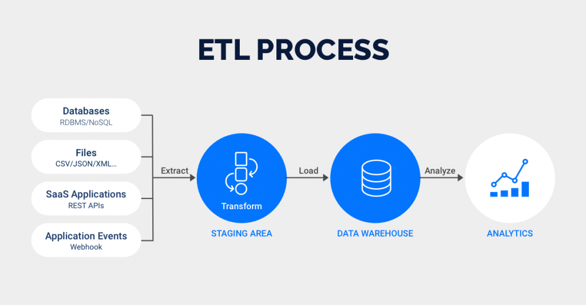

```python
import numpy as np
import pandas as pd
import datetime as dt
import panel as pn
import warnings
```


```python

```

# Processo de ETL





```python

```

## Vamos implementar o processo de ETL nos nossos dados


## Esconder warnings


```python
warnings.filterwarnings('ignore')
```


```python

```

# Lendo os dados da fonte

## Read file xlsx


```python
df = pd.read_excel('Webinar 8 - Database -Basic Banking Analytics in Power BI.xlsx')
```


```python
df.head()
```


<div><div id=69b8d989-b1d2-42ab-bb1b-347a3dc25ec7 style="display:none; background-color:#9D6CFF; color:white; width:200px; height:30px; padding-left:5px; border-radius:4px; flex-direction:row; justify-content:space-around; align-items:center;" onmouseover="this.style.backgroundColor='#BA9BF8'" onmouseout="this.style.backgroundColor='#9D6CFF'" onclick="window.commands?.execute('create-mitosheet-from-dataframe-output');">See Full Dataframe in Mito</div> <script> if (window.commands.hasCommand('create-mitosheet-from-dataframe-output')) document.getElementById('69b8d989-b1d2-42ab-bb1b-347a3dc25ec7').style.display = 'flex' </script> <table border="1" class="dataframe">
  <thead>
    <tr style="text-align: right;">
      <th></th>
      <th>Client ID</th>
      <th>Name</th>
      <th>Age</th>
      <th>Sex</th>
      <th>Location ID</th>
      <th>Joined Bank</th>
      <th>Banking Contact</th>
      <th>Nationality</th>
      <th>Occupation</th>
      <th>Investment Advisor</th>
      <th>...</th>
      <th>Amount of Credit Cards</th>
      <th>Credit Card Balance</th>
      <th>Bank Loans</th>
      <th>Bank Deposits</th>
      <th>Checking Accounts</th>
      <th>Saving Accounts</th>
      <th>Foreign Currency Account</th>
      <th>Business Lending</th>
      <th>Properties Owned</th>
      <th>Risk Weighting</th>
    </tr>
  </thead>
  <tbody>
    <tr>
      <th>0</th>
      <td>PKR81288</td>
      <td>Raymond Mills</td>
      <td>24</td>
      <td>Male</td>
      <td>34324</td>
      <td>2019-05-06</td>
      <td>Anthony Torres</td>
      <td>American</td>
      <td>Safety Technician IV</td>
      <td>Victor Dean</td>
      <td>...</td>
      <td>1</td>
      <td>484.5440</td>
      <td>7.762429e+05</td>
      <td>1.485829e+06</td>
      <td>6.036179e+05</td>
      <td>607332.455240</td>
      <td>12249.9584</td>
      <td>1.134475e+06</td>
      <td>1</td>
      <td>2</td>
    </tr>
    <tr>
      <th>1</th>
      <td>PKR65833</td>
      <td>Julia Spencer</td>
      <td>23</td>
      <td>Male</td>
      <td>42205</td>
      <td>2001-12-10</td>
      <td>Jonathan Hawkins</td>
      <td>African</td>
      <td>Software Consultant</td>
      <td>Jeremy Porter</td>
      <td>...</td>
      <td>1</td>
      <td>2256.8777</td>
      <td>1.270615e+06</td>
      <td>6.414828e+05</td>
      <td>2.295214e+05</td>
      <td>344635.157402</td>
      <td>61162.3089</td>
      <td>2.000526e+06</td>
      <td>1</td>
      <td>3</td>
    </tr>
    <tr>
      <th>2</th>
      <td>PKR47499</td>
      <td>Stephen Murray</td>
      <td>27</td>
      <td>Female</td>
      <td>7314</td>
      <td>2010-01-25</td>
      <td>Anthony Berry</td>
      <td>European</td>
      <td>Help Desk Operator</td>
      <td>Ernest Knight</td>
      <td>...</td>
      <td>2</td>
      <td>4568.7438</td>
      <td>1.052716e+06</td>
      <td>1.033402e+06</td>
      <td>6.526747e+05</td>
      <td>203054.348179</td>
      <td>79071.7794</td>
      <td>5.481376e+05</td>
      <td>1</td>
      <td>3</td>
    </tr>
    <tr>
      <th>3</th>
      <td>PKR72498</td>
      <td>Virginia Garza</td>
      <td>40</td>
      <td>Male</td>
      <td>34594</td>
      <td>1993-03-28</td>
      <td>Steve Diaz</td>
      <td>American</td>
      <td>Geologist II</td>
      <td>Eric Shaw</td>
      <td>...</td>
      <td>2</td>
      <td>4205.0010</td>
      <td>1.211951e+05</td>
      <td>1.048157e+06</td>
      <td>1.048157e+06</td>
      <td>234685.019326</td>
      <td>57513.6520</td>
      <td>1.148402e+06</td>
      <td>0</td>
      <td>4</td>
    </tr>
    <tr>
      <th>4</th>
      <td>PKR60181</td>
      <td>Melissa Sanders</td>
      <td>46</td>
      <td>Female</td>
      <td>41269</td>
      <td>2012-07-20</td>
      <td>Shawn Long</td>
      <td>American</td>
      <td>Assistant Professor</td>
      <td>Kevin Kim</td>
      <td>...</td>
      <td>1</td>
      <td>3779.4880</td>
      <td>1.048302e+06</td>
      <td>4.877825e+05</td>
      <td>4.466442e+05</td>
      <td>128351.452320</td>
      <td>30012.1360</td>
      <td>1.674412e+06</td>
      <td>0</td>
      <td>3</td>
    </tr>
  </tbody>
</table></div>


```python

```

# Transformação dos dados
  - ### Separação dos dados


```python
df_cliente = pd.DataFrame(columns=['Cliente ID','Nome','Idade','Genero','Nacionalidade','Ocupacao'])
```


```python
df_cliente['Cliente ID'] = df['Client ID']
df_cliente['Nome'] = df['Name']
df_cliente['Idade'] = df['Age']
df_cliente['Genero'] = df['Sex']
df_cliente['Nacionalidade'] = df['Nationality']
df_cliente['Ocupacao'] = df['Occupation']
```


```python
df_cliente.head()
```


<div><div id=6294c04b-2cfa-45c7-9314-e73edce2c9e0 style="display:none; background-color:#9D6CFF; color:white; width:200px; height:30px; padding-left:5px; border-radius:4px; flex-direction:row; justify-content:space-around; align-items:center;" onmouseover="this.style.backgroundColor='#BA9BF8'" onmouseout="this.style.backgroundColor='#9D6CFF'" onclick="window.commands?.execute('create-mitosheet-from-dataframe-output');">See Full Dataframe in Mito</div> <script> if (window.commands.hasCommand('create-mitosheet-from-dataframe-output')) document.getElementById('6294c04b-2cfa-45c7-9314-e73edce2c9e0').style.display = 'flex' </script> <table border="1" class="dataframe">
  <thead>
    <tr style="text-align: right;">
      <th></th>
      <th>Cliente ID</th>
      <th>Nome</th>
      <th>Idade</th>
      <th>Genero</th>
      <th>Nacionalidade</th>
      <th>Ocupacao</th>
    </tr>
  </thead>
  <tbody>
    <tr>
      <th>0</th>
      <td>PKR81288</td>
      <td>Raymond Mills</td>
      <td>24</td>
      <td>Male</td>
      <td>American</td>
      <td>Safety Technician IV</td>
    </tr>
    <tr>
      <th>1</th>
      <td>PKR65833</td>
      <td>Julia Spencer</td>
      <td>23</td>
      <td>Male</td>
      <td>African</td>
      <td>Software Consultant</td>
    </tr>
    <tr>
      <th>2</th>
      <td>PKR47499</td>
      <td>Stephen Murray</td>
      <td>27</td>
      <td>Female</td>
      <td>European</td>
      <td>Help Desk Operator</td>
    </tr>
    <tr>
      <th>3</th>
      <td>PKR72498</td>
      <td>Virginia Garza</td>
      <td>40</td>
      <td>Male</td>
      <td>American</td>
      <td>Geologist II</td>
    </tr>
    <tr>
      <th>4</th>
      <td>PKR60181</td>
      <td>Melissa Sanders</td>
      <td>46</td>
      <td>Female</td>
      <td>American</td>
      <td>Assistant Professor</td>
    </tr>
  </tbody>
</table></div>


```python
df_bank = pd.DataFrame(columns=['Cliente ID','Data de criacao','Contato no banco','Gerente bancario','Qtd de cartoes','Tipo de taxa','Tipo de cliente','Relacionamento bancario','Ponderacao de risco(RWA)','ID Bancario','Numero de propriedades'])
```


```python
df_bank['Cliente ID'] = df['Client ID']
df_bank['Data de criacao'] = df['Joined Bank']
df_bank['Contato no banco'] = df['Banking Contact']
df_bank['Gerente bancario'] = df['Investment Advisor']
df_bank['Qtd de cartoes'] = df['Amount of Credit Cards']
df_bank['Tipo de taxa'] = df['Fee Structure']
df_bank['Tipo de cliente'] = df['Loyalty Classification']
df_bank['Relacionamento bancario'] = df['Banking Relationship']
df_bank['Ponderacao de risco(RWA)'] = df['Risk Weighting']
df_bank['Numero de propriedades'] = df['Properties Owned']
df_bank['ID Bancario'] = df['Location ID']

```


```python
df_bank.head()
```


<div><div id=00d06f34-d980-45c0-b90d-b4b20963ea1d style="display:none; background-color:#9D6CFF; color:white; width:200px; height:30px; padding-left:5px; border-radius:4px; flex-direction:row; justify-content:space-around; align-items:center;" onmouseover="this.style.backgroundColor='#BA9BF8'" onmouseout="this.style.backgroundColor='#9D6CFF'" onclick="window.commands?.execute('create-mitosheet-from-dataframe-output');">See Full Dataframe in Mito</div> <script> if (window.commands.hasCommand('create-mitosheet-from-dataframe-output')) document.getElementById('00d06f34-d980-45c0-b90d-b4b20963ea1d').style.display = 'flex' </script> <table border="1" class="dataframe">
  <thead>
    <tr style="text-align: right;">
      <th></th>
      <th>Cliente ID</th>
      <th>Data de criacao</th>
      <th>Contato no banco</th>
      <th>Gerente bancario</th>
      <th>Qtd de cartoes</th>
      <th>Tipo de taxa</th>
      <th>Tipo de cliente</th>
      <th>Relacionamento bancario</th>
      <th>Ponderacao de risco(RWA)</th>
      <th>ID Bancario</th>
      <th>Numero de propriedades</th>
    </tr>
  </thead>
  <tbody>
    <tr>
      <th>0</th>
      <td>PKR81288</td>
      <td>2019-05-06</td>
      <td>Anthony Torres</td>
      <td>Victor Dean</td>
      <td>1</td>
      <td>High</td>
      <td>Jade</td>
      <td>Retail</td>
      <td>2</td>
      <td>34324</td>
      <td>1</td>
    </tr>
    <tr>
      <th>1</th>
      <td>PKR65833</td>
      <td>2001-12-10</td>
      <td>Jonathan Hawkins</td>
      <td>Jeremy Porter</td>
      <td>1</td>
      <td>High</td>
      <td>Jade</td>
      <td>Retail</td>
      <td>3</td>
      <td>42205</td>
      <td>1</td>
    </tr>
    <tr>
      <th>2</th>
      <td>PKR47499</td>
      <td>2010-01-25</td>
      <td>Anthony Berry</td>
      <td>Ernest Knight</td>
      <td>2</td>
      <td>High</td>
      <td>Gold</td>
      <td>Institutional</td>
      <td>3</td>
      <td>7314</td>
      <td>1</td>
    </tr>
    <tr>
      <th>3</th>
      <td>PKR72498</td>
      <td>1993-03-28</td>
      <td>Steve Diaz</td>
      <td>Eric Shaw</td>
      <td>2</td>
      <td>Mid</td>
      <td>Silver</td>
      <td>Institutional</td>
      <td>4</td>
      <td>34594</td>
      <td>0</td>
    </tr>
    <tr>
      <th>4</th>
      <td>PKR60181</td>
      <td>2012-07-20</td>
      <td>Shawn Long</td>
      <td>Kevin Kim</td>
      <td>1</td>
      <td>Mid</td>
      <td>Platinum</td>
      <td>Private Bank</td>
      <td>3</td>
      <td>41269</td>
      <td>0</td>
    </tr>
  </tbody>
</table></div>


```python

```


```python
df_fluxoBancario = pd.DataFrame(columns=['Cliente ID','Rendimento estimado','Caixa Social( INSS)','Balanco cartao de credito','Emprestimos bancarios','Depositos bancarios','Conta corrente','Conta Poupanca','Conta moeda estrangeira','Emprestimo comercial'])
```


```python
df_fluxoBancario['Cliente ID'] = df['Client ID']
df_fluxoBancario['Rendimento estimado'] = df['Estimated Income']
df_fluxoBancario['Caixa Social( INSS)'] = df['Superannuation Savings']
df_fluxoBancario['Balanco cartao de credito'] = df['Credit Card Balance']
df_fluxoBancario['Emprestimos bancarios'] = df['Bank Loans']
df_fluxoBancario['Depositos bancarios'] = df['Bank Deposits']
df_fluxoBancario['Conta corrente'] = df['Checking Accounts']
df_fluxoBancario['Conta Poupanca'] = df['Saving Accounts']
df_fluxoBancario['Conta moeda estrangeira'] = df['Foreign Currency Account']
df_fluxoBancario['Emprestimo comercial'] = df['Business Lending']
```


```python
df_fluxoBancario.head()
```


<div><div id=c40845dc-f82d-46d0-ad00-a96e4ebc85e2 style="display:none; background-color:#9D6CFF; color:white; width:200px; height:30px; padding-left:5px; border-radius:4px; flex-direction:row; justify-content:space-around; align-items:center;" onmouseover="this.style.backgroundColor='#BA9BF8'" onmouseout="this.style.backgroundColor='#9D6CFF'" onclick="window.commands?.execute('create-mitosheet-from-dataframe-output');">See Full Dataframe in Mito</div> <script> if (window.commands.hasCommand('create-mitosheet-from-dataframe-output')) document.getElementById('c40845dc-f82d-46d0-ad00-a96e4ebc85e2').style.display = 'flex' </script> <table border="1" class="dataframe">
  <thead>
    <tr style="text-align: right;">
      <th></th>
      <th>Cliente ID</th>
      <th>Rendimento estimado</th>
      <th>Caixa Social( INSS)</th>
      <th>Balanco cartao de credito</th>
      <th>Emprestimos bancarios</th>
      <th>Depositos bancarios</th>
      <th>Conta corrente</th>
      <th>Conta Poupanca</th>
      <th>Conta moeda estrangeira</th>
      <th>Emprestimo comercial</th>
    </tr>
  </thead>
  <tbody>
    <tr>
      <th>0</th>
      <td>PKR81288</td>
      <td>75384.7686</td>
      <td>17677.95</td>
      <td>484.5440</td>
      <td>7.762429e+05</td>
      <td>1.485829e+06</td>
      <td>6.036179e+05</td>
      <td>607332.455240</td>
      <td>12249.9584</td>
      <td>1.134475e+06</td>
    </tr>
    <tr>
      <th>1</th>
      <td>PKR65833</td>
      <td>289834.3140</td>
      <td>17398.92</td>
      <td>2256.8777</td>
      <td>1.270615e+06</td>
      <td>6.414828e+05</td>
      <td>2.295214e+05</td>
      <td>344635.157402</td>
      <td>61162.3089</td>
      <td>2.000526e+06</td>
    </tr>
    <tr>
      <th>2</th>
      <td>PKR47499</td>
      <td>169935.2252</td>
      <td>42825.90</td>
      <td>4568.7438</td>
      <td>1.052716e+06</td>
      <td>1.033402e+06</td>
      <td>6.526747e+05</td>
      <td>203054.348179</td>
      <td>79071.7794</td>
      <td>5.481376e+05</td>
    </tr>
    <tr>
      <th>3</th>
      <td>PKR72498</td>
      <td>356808.1125</td>
      <td>5473.15</td>
      <td>4205.0010</td>
      <td>1.211951e+05</td>
      <td>1.048157e+06</td>
      <td>1.048157e+06</td>
      <td>234685.019326</td>
      <td>57513.6520</td>
      <td>1.148402e+06</td>
    </tr>
    <tr>
      <th>4</th>
      <td>PKR60181</td>
      <td>130711.6800</td>
      <td>48077.60</td>
      <td>3779.4880</td>
      <td>1.048302e+06</td>
      <td>4.877825e+05</td>
      <td>4.466442e+05</td>
      <td>128351.452320</td>
      <td>30012.1360</td>
      <td>1.674412e+06</td>
    </tr>
  </tbody>
</table></div>


```python

```

# Transformação dos dados
  - ### Transformação de dados


```python
def taxa_manutencao(valor):
    if(valor=='High'):
        taxa = 0.03
    elif (valor=='Mid'):
        taxa = 0.02
    else:
        taxa = 0.01
    return taxa


def diferenca_data(data,formato):
    data = dt.datetime.now() - data
    valor = round(data/np.timedelta64(1,formato),0)
    if(float(valor)<1):
        return "1 Ano"
    else:
        return format(valor)+' Anos'
    
def classificar_rendimento(rendimento):
    if(rendimento<100000):
        return 'Baixo'

    elif(rendimento<300000):
        return 'Médio'
    else:
        return 'Alto'
    
    
    
```


```python
df_bank['Taxa de manutencao'] = df['Fee Structure'].apply(taxa_manutencao)
```


```python
df_bank.tail(10)
```


<div><div id=5b619cf7-ffe4-4ac1-aa95-c0b5e8a44086 style="display:none; background-color:#9D6CFF; color:white; width:200px; height:30px; padding-left:5px; border-radius:4px; flex-direction:row; justify-content:space-around; align-items:center;" onmouseover="this.style.backgroundColor='#BA9BF8'" onmouseout="this.style.backgroundColor='#9D6CFF'" onclick="window.commands?.execute('create-mitosheet-from-dataframe-output');">See Full Dataframe in Mito</div> <script> if (window.commands.hasCommand('create-mitosheet-from-dataframe-output')) document.getElementById('5b619cf7-ffe4-4ac1-aa95-c0b5e8a44086').style.display = 'flex' </script> <table border="1" class="dataframe">
  <thead>
    <tr style="text-align: right;">
      <th></th>
      <th>Cliente ID</th>
      <th>Data de criacao</th>
      <th>Contato no banco</th>
      <th>Gerente bancario</th>
      <th>Qtd de cartoes</th>
      <th>Tipo de taxa</th>
      <th>Tipo de cliente</th>
      <th>Relacionamento bancario</th>
      <th>Ponderacao de risco(RWA)</th>
      <th>ID Bancario</th>
      <th>Numero de propriedades</th>
      <th>Taxa de manutencao</th>
      <th>Periodo Relacionamento</th>
    </tr>
  </thead>
  <tbody>
    <tr>
      <th>2990</th>
      <td>PKR19589</td>
      <td>1996-05-22</td>
      <td>Shawn Long</td>
      <td>Carl Anderson</td>
      <td>1</td>
      <td>High</td>
      <td>Jade</td>
      <td>Commercial</td>
      <td>2</td>
      <td>27490</td>
      <td>3</td>
      <td>0.03</td>
      <td>25.0Anos</td>
    </tr>
    <tr>
      <th>2991</th>
      <td>PKR54576</td>
      <td>2002-09-17</td>
      <td>Anthony Torres</td>
      <td>Daniel Carroll</td>
      <td>1</td>
      <td>High</td>
      <td>Jade</td>
      <td>Retail</td>
      <td>1</td>
      <td>7006</td>
      <td>2</td>
      <td>0.03</td>
      <td>19.0Anos</td>
    </tr>
    <tr>
      <th>2992</th>
      <td>PKR47226</td>
      <td>2017-04-17</td>
      <td>Samuel Fowler</td>
      <td>Lawrence Sanchez</td>
      <td>1</td>
      <td>Mid</td>
      <td>Gold</td>
      <td>Institutional</td>
      <td>2</td>
      <td>14369</td>
      <td>1</td>
      <td>0.02</td>
      <td>5.0Anos</td>
    </tr>
    <tr>
      <th>2993</th>
      <td>PKR33338</td>
      <td>2007-11-08</td>
      <td>James Castillo</td>
      <td>Sean Vasquez</td>
      <td>1</td>
      <td>High</td>
      <td>Silver</td>
      <td>Retail</td>
      <td>3</td>
      <td>21725</td>
      <td>3</td>
      <td>0.03</td>
      <td>14.0Anos</td>
    </tr>
    <tr>
      <th>2994</th>
      <td>PKR24309</td>
      <td>1993-01-21</td>
      <td>Paul Holmes</td>
      <td>Ernest Knight</td>
      <td>1</td>
      <td>Mid</td>
      <td>Platinum</td>
      <td>Retail</td>
      <td>5</td>
      <td>6198</td>
      <td>3</td>
      <td>0.02</td>
      <td>29.0Anos</td>
    </tr>
    <tr>
      <th>2995</th>
      <td>PKR66827</td>
      <td>2014-10-09</td>
      <td>Joshua Bennett</td>
      <td>Daniel Carroll</td>
      <td>1</td>
      <td>High</td>
      <td>Gold</td>
      <td>Retail</td>
      <td>3</td>
      <td>8760</td>
      <td>1</td>
      <td>0.03</td>
      <td>7.0Anos</td>
    </tr>
    <tr>
      <th>2996</th>
      <td>PKR40556</td>
      <td>2009-02-05</td>
      <td>Dennis Ruiz</td>
      <td>Peter Castillo</td>
      <td>1</td>
      <td>Mid</td>
      <td>Gold</td>
      <td>Private Bank</td>
      <td>2</td>
      <td>32837</td>
      <td>1</td>
      <td>0.02</td>
      <td>13.0Anos</td>
    </tr>
    <tr>
      <th>2997</th>
      <td>PKR72414</td>
      <td>2009-12-29</td>
      <td>Joshua Ryan</td>
      <td>Steve Sanchez</td>
      <td>1</td>
      <td>Low</td>
      <td>Jade</td>
      <td>Retail</td>
      <td>2</td>
      <td>36088</td>
      <td>2</td>
      <td>0.01</td>
      <td>12.0Anos</td>
    </tr>
    <tr>
      <th>2998</th>
      <td>PKR46652</td>
      <td>2006-02-13</td>
      <td>Nicholas Cunningham</td>
      <td>Juan Ramirez</td>
      <td>2</td>
      <td>Mid</td>
      <td>Jade</td>
      <td>Commercial</td>
      <td>1</td>
      <td>24871</td>
      <td>3</td>
      <td>0.02</td>
      <td>16.0Anos</td>
    </tr>
    <tr>
      <th>2999</th>
      <td>PKR40216</td>
      <td>2005-12-08</td>
      <td>Joe Hanson</td>
      <td>Peter Castillo</td>
      <td>1</td>
      <td>High</td>
      <td>Jade</td>
      <td>Retail</td>
      <td>1</td>
      <td>38518</td>
      <td>1</td>
      <td>0.03</td>
      <td>16.0Anos</td>
    </tr>
  </tbody>
</table></div>


```python
df_bank['Periodo Relacionamento'] = df['Joined Bank'].apply(diferenca_data,formato='Y')
```


```python
df_bank.head()
```


<div><div id=aa0557ee-3ae0-4eb4-a873-8500eade77ad style="display:none; background-color:#9D6CFF; color:white; width:200px; height:30px; padding-left:5px; border-radius:4px; flex-direction:row; justify-content:space-around; align-items:center;" onmouseover="this.style.backgroundColor='#BA9BF8'" onmouseout="this.style.backgroundColor='#9D6CFF'" onclick="window.commands?.execute('create-mitosheet-from-dataframe-output');">See Full Dataframe in Mito</div> <script> if (window.commands.hasCommand('create-mitosheet-from-dataframe-output')) document.getElementById('aa0557ee-3ae0-4eb4-a873-8500eade77ad').style.display = 'flex' </script> <table border="1" class="dataframe">
  <thead>
    <tr style="text-align: right;">
      <th></th>
      <th>Cliente ID</th>
      <th>Data de criacao</th>
      <th>Contato no banco</th>
      <th>Gerente bancario</th>
      <th>Qtd de cartoes</th>
      <th>Tipo de taxa</th>
      <th>Tipo de cliente</th>
      <th>Relacionamento bancario</th>
      <th>Ponderacao de risco(RWA)</th>
      <th>ID Bancario</th>
      <th>Numero de propriedades</th>
      <th>Taxa de manutencao</th>
      <th>Periodo Relacionamento</th>
    </tr>
  </thead>
  <tbody>
    <tr>
      <th>0</th>
      <td>PKR81288</td>
      <td>2019-05-06</td>
      <td>Anthony Torres</td>
      <td>Victor Dean</td>
      <td>1</td>
      <td>High</td>
      <td>Jade</td>
      <td>Retail</td>
      <td>2</td>
      <td>34324</td>
      <td>1</td>
      <td>0.03</td>
      <td>3.0 Anos</td>
    </tr>
    <tr>
      <th>1</th>
      <td>PKR65833</td>
      <td>2001-12-10</td>
      <td>Jonathan Hawkins</td>
      <td>Jeremy Porter</td>
      <td>1</td>
      <td>High</td>
      <td>Jade</td>
      <td>Retail</td>
      <td>3</td>
      <td>42205</td>
      <td>1</td>
      <td>0.03</td>
      <td>20.0 Anos</td>
    </tr>
    <tr>
      <th>2</th>
      <td>PKR47499</td>
      <td>2010-01-25</td>
      <td>Anthony Berry</td>
      <td>Ernest Knight</td>
      <td>2</td>
      <td>High</td>
      <td>Gold</td>
      <td>Institutional</td>
      <td>3</td>
      <td>7314</td>
      <td>1</td>
      <td>0.03</td>
      <td>12.0 Anos</td>
    </tr>
    <tr>
      <th>3</th>
      <td>PKR72498</td>
      <td>1993-03-28</td>
      <td>Steve Diaz</td>
      <td>Eric Shaw</td>
      <td>2</td>
      <td>Mid</td>
      <td>Silver</td>
      <td>Institutional</td>
      <td>4</td>
      <td>34594</td>
      <td>0</td>
      <td>0.02</td>
      <td>29.0 Anos</td>
    </tr>
    <tr>
      <th>4</th>
      <td>PKR60181</td>
      <td>2012-07-20</td>
      <td>Shawn Long</td>
      <td>Kevin Kim</td>
      <td>1</td>
      <td>Mid</td>
      <td>Platinum</td>
      <td>Private Bank</td>
      <td>3</td>
      <td>41269</td>
      <td>0</td>
      <td>0.02</td>
      <td>9.0 Anos</td>
    </tr>
  </tbody>
</table></div>


```python
df_fluxoBancario['Classificacao Rendimento'] = df_fluxoBancario['Rendimento estimado'].apply(classificar_rendimento)
```


```python
df_fluxoBancario.head()
```


<div><div id=18d37405-bbc0-48ae-ac20-6b398cdc0644 style="display:none; background-color:#9D6CFF; color:white; width:200px; height:30px; padding-left:5px; border-radius:4px; flex-direction:row; justify-content:space-around; align-items:center;" onmouseover="this.style.backgroundColor='#BA9BF8'" onmouseout="this.style.backgroundColor='#9D6CFF'" onclick="window.commands?.execute('create-mitosheet-from-dataframe-output');">See Full Dataframe in Mito</div> <script> if (window.commands.hasCommand('create-mitosheet-from-dataframe-output')) document.getElementById('18d37405-bbc0-48ae-ac20-6b398cdc0644').style.display = 'flex' </script> <table border="1" class="dataframe">
  <thead>
    <tr style="text-align: right;">
      <th></th>
      <th>Cliente ID</th>
      <th>Rendimento estimado</th>
      <th>Caixa Social( INSS)</th>
      <th>Balanco cartao de credito</th>
      <th>Emprestimos bancarios</th>
      <th>Depositos bancarios</th>
      <th>Conta corrente</th>
      <th>Conta Poupanca</th>
      <th>Conta moeda estrangeira</th>
      <th>Emprestimo comercial</th>
      <th>Classificacao Rendimento</th>
    </tr>
  </thead>
  <tbody>
    <tr>
      <th>0</th>
      <td>PKR81288</td>
      <td>75384.7686</td>
      <td>17677.95</td>
      <td>484.5440</td>
      <td>7.762429e+05</td>
      <td>1.485829e+06</td>
      <td>6.036179e+05</td>
      <td>607332.455240</td>
      <td>12249.9584</td>
      <td>1.134475e+06</td>
      <td>Baixo</td>
    </tr>
    <tr>
      <th>1</th>
      <td>PKR65833</td>
      <td>289834.3140</td>
      <td>17398.92</td>
      <td>2256.8777</td>
      <td>1.270615e+06</td>
      <td>6.414828e+05</td>
      <td>2.295214e+05</td>
      <td>344635.157402</td>
      <td>61162.3089</td>
      <td>2.000526e+06</td>
      <td>Médio</td>
    </tr>
    <tr>
      <th>2</th>
      <td>PKR47499</td>
      <td>169935.2252</td>
      <td>42825.90</td>
      <td>4568.7438</td>
      <td>1.052716e+06</td>
      <td>1.033402e+06</td>
      <td>6.526747e+05</td>
      <td>203054.348179</td>
      <td>79071.7794</td>
      <td>5.481376e+05</td>
      <td>Médio</td>
    </tr>
    <tr>
      <th>3</th>
      <td>PKR72498</td>
      <td>356808.1125</td>
      <td>5473.15</td>
      <td>4205.0010</td>
      <td>1.211951e+05</td>
      <td>1.048157e+06</td>
      <td>1.048157e+06</td>
      <td>234685.019326</td>
      <td>57513.6520</td>
      <td>1.148402e+06</td>
      <td>Alto</td>
    </tr>
    <tr>
      <th>4</th>
      <td>PKR60181</td>
      <td>130711.6800</td>
      <td>48077.60</td>
      <td>3779.4880</td>
      <td>1.048302e+06</td>
      <td>4.877825e+05</td>
      <td>4.466442e+05</td>
      <td>128351.452320</td>
      <td>30012.1360</td>
      <td>1.674412e+06</td>
      <td>Médio</td>
    </tr>
  </tbody>
</table></div>


```python

```

# Carrega os dados no data warehouse
 - Exportar dados para excel e carregar no data warehouse (mysql)


```python
df_bank.to_excel('fbanco_cliente.xlsx',index=False)
df_cliente.to_excel('dcliente_info.xlsx',index=False)
df_fluxoBancario.to_excel('ftransacoes_cliente.xlsx',index=False)
```


```python

```
